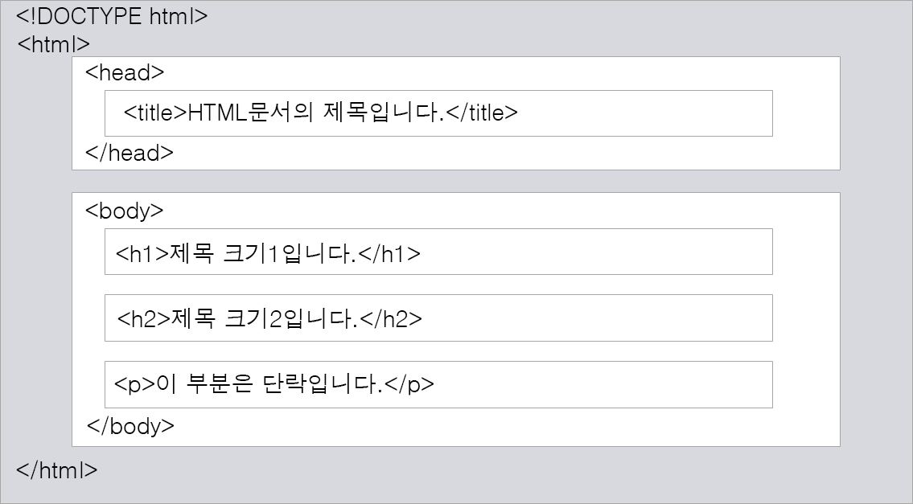

- **HTML (HyperText Markup Language)**

  HTML은 기본적으로 문서를 구조화해주는 지극히 간단한 언어, 웹사이트를 만드는 데에 있어서 여러 요소들이 모여 하나의 웹페이지를 구성하게된다

  > 말 그대로 **하이퍼텍스트**를 **마크업**하는 언어.

    - **하이퍼텍스트란?**

      웹사이트에서 링크를 클릭해 다른 문서나 사이트로 즉시 이동할 수 있는 기능을 말한다.

    - **마크업이란?**

      태그를 사용해서 문서에서 어느 부분이 제목이고 본문인지, 어느 부분이 사진이고 링크인지 표시하는 것을 말한다.

    ***결론적으로 웹에서 자유롭게 오갈 수 있느는 웹 문서를 만드는 언어가 HTML!이라고 정리할 수 있다.***

      
 왜 HTML을 HTML5라고 하는가?(HTML 간략한 역사) 

            
    인터넷 초창기의 HTML은 텍스트와 이미지를 한 줄씩 웹브라우저 화면에 표시하는 정도였다. 
    하지만 웹사용자가 늘고 웹 브라우저들이 하나 둘 등장하면서 표준이 필요하게 되었다. 
    웹 창시자인 ‘팀 버너스 리’ 가 ‘W3C(World Wide Web Consortium)’라는 단체를 설립하고 HTML 2.0과 
    HTML 3.2 그리고 HTML 4.0을 차례로 발표, 그 후로 인터넷은 점점 더 빨리 발전해 웹에서 처리해야할 요구사항들이 
    더 많아졌다. 그래서 애플, 모질라, 오페라, 구글 등의 주요 브라우저 업체들은 기존 HTML문서도 지원하면서 
    최신 웹 환경에 맞게 기존 HTML을 확장하려는 생각으로 
    WHATWG(**[Web Hypertext Application Technology Working Group](https://whatwg.org/)**) 를 구성했다.
    이것이 HTML5로 받아들여졌고 HTML이라고 부르면 그건 HTML5라고 보면 되는 것이다.

      

    
웹의 특징

- 웹은 인터넷 상에서 텍스트나 그림, 소리, 영상 등과 같은 멀티미디어 정보를 하이퍼텍스트 방식으로 연결하여 제공합니다. 
- 하이퍼텍스트(hypertext)란 문서 내부에 또 다른 문서로 연결되는 참조를 집어 넣음으로써 웹 상에 존재하는 여러 문서끼리 서로 참조할 수 있는 기술을 의미합니다. 이때 문서 내부에서 또 다른 문서로 연결되는 참조를 하이퍼링크(hyperlink)라고 부릅니다. 
- **웹 브라우저 -> 운영체제 -> 하드웨어**를 거쳐 **서버**에 전달되게 되며, **서버는 요청을 받아하드웨어 -> 운영체제 -> 웹 서버**에 도달하며 도메인에 대한 index.html 파일을 찾아 다시 클라이언트한테 전달해줍니다.
              중간에 있는 DNS 서버란 도메인에 대한 입력값을 IP로 되돌려 주며,이는 웹 서버를 찾아가는 위치가 됩니다.
              
    >즉, 우리가 보는 현재의 웹은 클라이언트와 서버가 있으며, 클라이언트의 요청에 어딘가에 있는 서버에 있는 파일을 불러와 우리의 브라우저에 띄우게 되는것 입니다.
  
 

### HTML의 기본 구조
