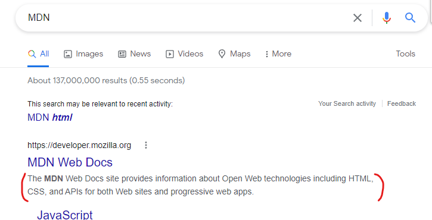

#HTML의 **`meta`**

  HTML의 [head](https://developer.mozilla.org/ko/docs/Glossary/Head) 는 페이지를 열 때 웹 브라우저에 표시되지 않습니다. 
  
  head는 [title](https://developer.mozilla.org/ko/docs/Web/HTML/Element/title) 같은 페이지나, [CSS](https://developer.mozilla.org/ko/docs/Glossary/CSS) 의 링크(HTML 컨텐츠를 CSS로 스타일링하기를 원한다면),</br>
  파비콘(favicon), 그리고 다른 **메타데이터(작성자, 중요한 키워드와 같은 HTML에 대한 내용)** 를 포함한다.

  여기서 *메타데이터* !

  HTML 문서가 어떤 내용을 담고 있고, 키워드는 무엇이며, 누가 만들었는지에 대한 정보를 담고있는 태그이다. 
  > **즉, 메타데이터는 데이터를 설명하는 데이터이다.**

  ### **charset (문서의 character 인코딩을 특정하기)**

    ```html
    <meta charset="utf-8" />
    ```

  `charset`요소는 문서에서 허용하는 문자 집합에 대해서 간단히 표시한다.

  `utf-8`은 전셰계적인 character 집합으로 많은 언어의 문자들을 포함한다.

  **웹 페이지에서 어떤 문자라도 취급할 수 있다는 것을 포함한다.**
    
  ---

  ### **name**

  `name` **요소는 메타 요소가 어떤 정보의 형태를 갖고 있는지 알려준다.**

  `content` **요소는 실제 메타 데이터의 컨텐츠입니다. 머릿말을 요약하는데 유용한다.**

    ```html
    <meta name="author" content="Chris Mills" />
    
    <meta
      name="description"
      content="The MDN Web Docs site provides information about Open Web technologies including HTML, CSS, and APIs for both Web sites and progressive web apps."
    />
    ```
  