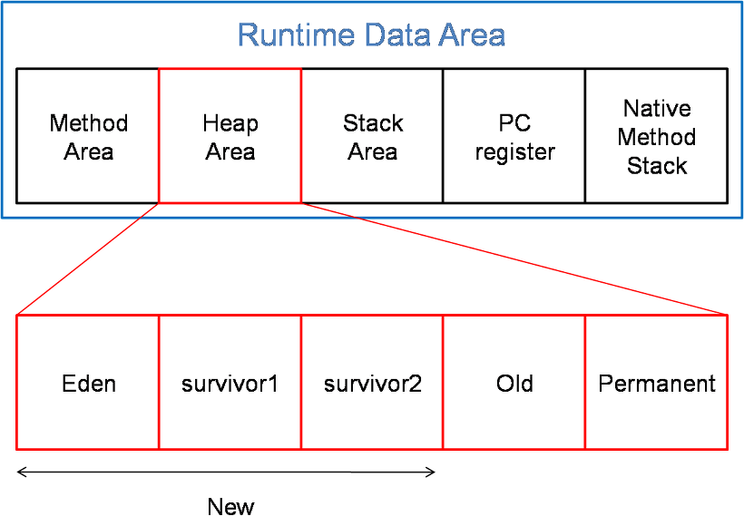
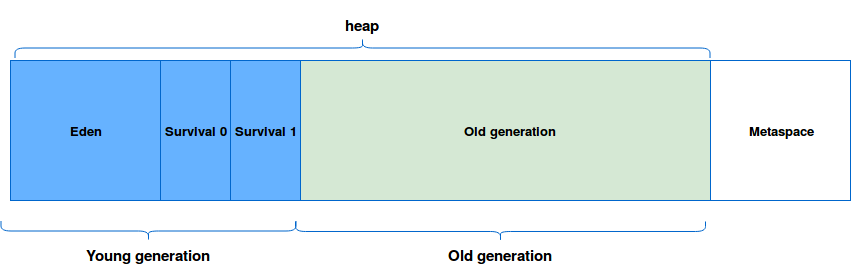
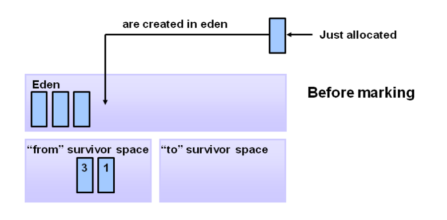
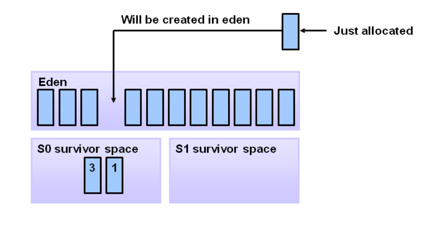
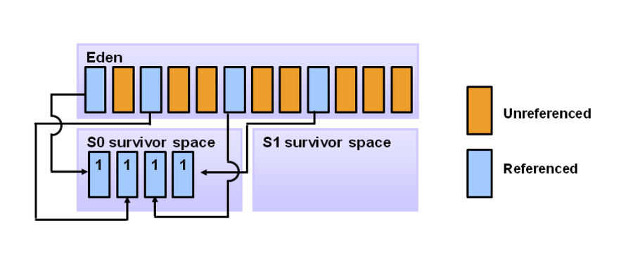
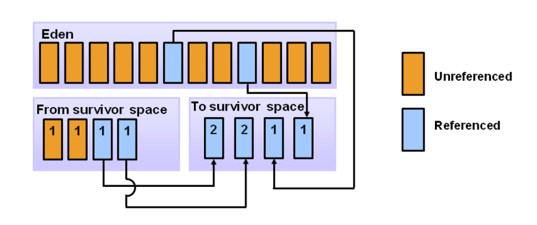
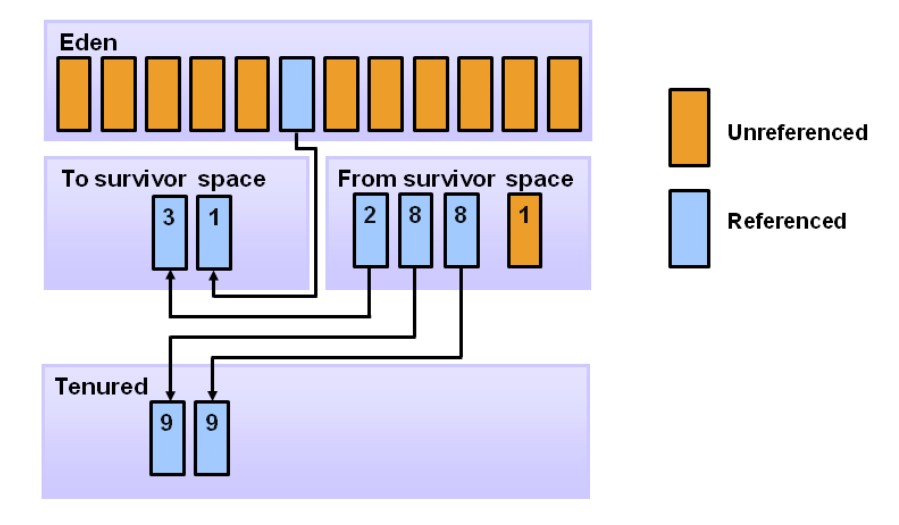

## Garbage Collection이란?

- 프로그램을 개발하다 보면 유효하지 않은 메모리(Garbage)가 발생한다.
- 이러한 사용하지 않는 메모리 영역을 Grabag Collector가 찾아 알아서 정리 시켜주는 것.
- java 이전의 c나 c++언어에서는 사용자가 직접 메모리 할당과 해제를 컨트롤 해주어야 했다.
- 하지만 java에서는 Garbage Collector가 알아서 메모리 영역을 해제 시켜 주기 때문에 신경을 쓰지 않아도 된다.

## Heap Area(힙 영역)

- JVM이 관리하는 프로그램에서 데이터를 저장하기 위해 동적으로 할당하여 사용하는 영역
- New 연산자로 생성된 객체, 인스턴스와 배열을 저장한다. → stack 영역에 있는 데이터를 제외한 모든 데이터가 힙 영역에 존재한다.
- 참조하는 변수나 필드가 없으면 GC의 대상이 된다.

  ### java 7이하 버전

### java 8이상 버전

### 차이점

- Permanent는 클래스 데이터의 정보들 즉 Meta Data를 저장하는 공간이다.
- java7 이하 버전에서는 JVM안에 Permanent영역에서 Meta Data를 관리했다.
- java8버전 이후 Permanent영역은 없어지고 Metaspace란 이름으로 바껴 heap영역이 아닌 OS의 native메모리에 저장되어 Os가 자동으로 메모리 크기를 늘려준다. → 개발자가 영역 확보의 상한을 크게 의식할 필요가 없어지게 됨.

### Young 영역

- Eden, Survival 0, Survival 1로 구성된 영역
- 새롭게 생성된 객체가 할당되는 영역
- 대부분의 객체가 금방 접근 불가능한 상태(Unreachable)상태가 되기 때문에, Young영역에서 생성되었다가 사라진다.
- Young 영역에 대한 Garbage Collection을 Minor GC라고 부른다.

### Old 영역

- Old로 구성된 영역
- Young영역에서 접근 가능한 상태(Reachable)상태를 유지하여 살아남은 객체가 복사되는 영역
- Young 영역보다 크게 할당되며, 영역의 크기가 크기 때문에 GC는 적게 일어난다.
- Old영역에 대한 Garbage Collection을 Major GC라고 부른다.

## Garbage Collection 동작 방식

- Young 영역과 Old영역은 서로 다른 메모리 구조로 되어 있기 때문에, 세부적인 동작 방식은 다르지만 기본적으로 2가지의 공통적인 단계를 따른다.
- Stop The World
    - GC를 실행하기 위해 JVM이 애플리케이션의 실행을 멈추는 것.
    - GC를 실행하는 쓰레드를 제외한 모든 쓰레드들의 작업이 중단되고 GC가 완료되면, 작업이 재개된다.
- Mark and Sweep
    - Mark: 사용되는 메모리와 사용되지 않는 메모리를 식별하는 작업
    - Sweep: Mark 단계에서 사용되지 않음으로 식별된 메모리를 해체하는 작업
    - Stop The World를 통해 모든 작업을 중단시키면 GC는 스택의 모든 변수 또는 Reachable 객체를 스캔하면서 어떤 객체를 참조하고 있는지 탐색한다.
    - 사용되고 있는 메모리를 식별하면 Mark를 하고 Mark가 되지 않은 객체들을 메모리에서 제거한다.

### Young 영역

- Young 영역에서 일어나는 GC는 다음과 같이 동작된다.

  

- 새로 들어온 데이터는 모두 Eden영역에 저장된다.

  

- Eden영역에 데이터가 모두 저장되면 minor GC가 발동되며, mark and sweap을 실행한다.

  

- Referenced 데이터를 찾아 marking을 하고 count를 증가시킨 후, survivor0 space로 이동한다.
- marking되지 않은 데이터들은 모두 제거한다.

  

- 이후 Eden영역이나 Survivor space가 다 찰 경우 Mark and sweap을 진행하며 반대편 Survivor space로 몰아 넣는다.
- 한쪽으로 몰아넣는 데이터를 접근하는 것을 빠르게 하기 위해서 이다.
- 위 과정은 GC가 발생할 경우마다 계속 반복된다.

  

- GC가 반복되는 도중 Survivor Space에 있는 데이터 중 임계값을 넘는 데이터가 있으면 old 영역으로 승격된다.
- 위 사진은 임계값이 8이라고 가정한 그림으로 임계값은 자유롭게 설정할 수 있다.

### Minor GC 특징

- old영역에 비해 메모리의 크기가 작기 때문에 보통 0.5초에서 1초사이에 끝난다. → 애플리케이션에 크게 영향을 주지 않음.
- HotSpot JVM(대표적인 JVM)에서는 bump the pointer와 TLABs라는 기술을 사용해 Eden 영역에 객체를 빠르게 할당하고 있다.
- bump the pointer : Eden영역에 마지막으로 할당된 객체의 주소를 캐싱해 두는 것.
    - 마지막 객체의 주소만을 사용해서 메모리를 탐색할 필요없이 바로바로 메모리에 데이터를 할당할 수 있다.
- TLABs(Thread-Local Allocation Buffers): 각각의 쓰레드 마다 Eden 영역에 객체를 할당하기 위한 주소를 부여 하는 것.
    - 싱글 쓰레드 환경이라면 문제가 없지만 멀티쓰레드의 환경일 경우 락을 걸어 동기화를 해주어야 하는 문제가 있는데, TLABs를 사용해  쓰레드가 자기가 할당받은 주소에만 데이터를 저장하기 때문에 동기화 없이 메모리를 빠르게 할당할 수 있다.

### Old 영역

- Old영역에서 일어나는 GC는 Major GC로 Old 영역이 Young영역보다 큰 메모리 크기를 가지고 있기 때문에 Minor GC보다 Major GC가 일반적으로 훨씬 오래 걸린다. → 약 10배이상
- 그래서 가능하면 old영역은 데이터 적재용으로 쓰고 최대한 Minor GC만 발생시키는 것이 좋다.
- Major GC의 알고리즘
    - Serial GC
    - Parallel GC
    - Parallel Old GC
    - CMS GC
    - G1 GC
    - Z GC(가장 최신)
- Major GC 참고 자료
    - [https://d2.naver.com/helloworld/1329](https://d2.naver.com/helloworld/1329)
    - [https://mangkyu.tistory.com/119](https://mangkyu.tistory.com/119)
    - [https://www.baeldung.com/jvm-garbage-collectors](https://www.baeldung.com/jvm-garbage-collectors)

## 참고

---

GarbageCollection 관련

- [https://d2.naver.com/helloworld/1329](https://d2.naver.com/helloworld/1329)

GarbageCollection 동작 방식

- [https://kamang-it.tistory.com/entry/Java에서의-가비지컬렉터Garbage-CollectorGC돌아가는-원리-파해치기](https://kamang-it.tistory.com/entry/Java%EC%97%90%EC%84%9C%EC%9D%98-%EA%B0%80%EB%B9%84%EC%A7%80%EC%BB%AC%EB%A0%89%ED%84%B0Garbage-CollectorGC%EB%8F%8C%EC%95%84%EA%B0%80%EB%8A%94-%EC%9B%90%EB%A6%AC-%ED%8C%8C%ED%95%B4%EC%B9%98%EA%B8%B0)