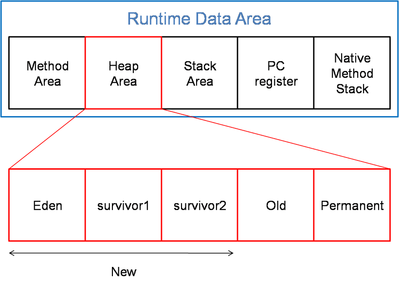
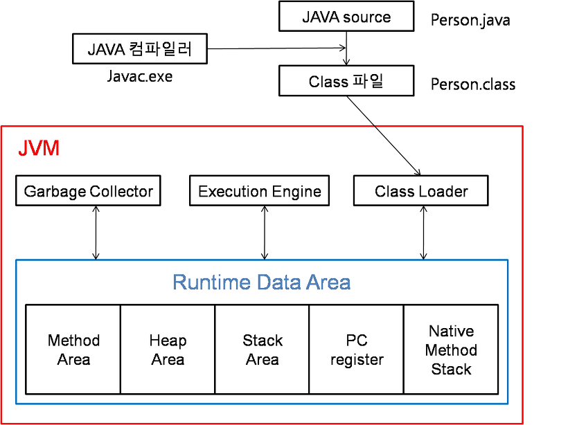

## JVM(Java Virtual Machine)

- java를 실행하기 위한 가상 기계
- 자바로 작성된 모든 애플리케이션은 JVM에서만 실행되기 때문에 자바를 실행하기 위해선 반드시 JVM이 필요하다.

### JVM 구조

1. Class Loader
    - 자바에서 소스를 작성하면 .java파일이 생성되고 .java소스를 컴파일하면 .class파일(바이트 코드)이 생성된다.
    - 이런 클래스 파일들을 찾고 엮어서 JVM이 운영체제로부터 할당받는 메모리 영역인 Runtime Data Area로 적재하는 역할을 Class Loader가 한다.  → 메모리에 로딩
2. Execution Engine
    - Class Loader에 의해 메모리에 Load된 클래스(바이트 코드)들을 기계어로 변경해 명령어 단위로 실행하는 역할을 한다.
    - 인터프리터 방식 : 명령어를 하나하나 실행하는 방식
        - 초기 방식으로 속도가 느리다는 단점이 있다.
    - JIT 컴파일러: 프로그램을 실제 실행하는 시점에 전체 바이트 코드를 각 OS에 맞는 네이티브 코드로 변경해서 Execution Engine이 네이티브로 컴파일된 코드를 실행하는 것.
        - JIT컴파일러는 같은 코드를 매번 해석하지 않고, 실행할 때 컴파일을 하면서 해당 코드를 캐싱한다. 그래서 이후 바뀐 부분만 컴파일하고 나머지는 캐싱된 코드를 사용한다.
        - Native Code로 변환하는 데에는 비용이 소모된다.
    - 인터프리터 방식을 사용하다 일정 기준이 넘어가면 JIT 컴파일 방식으로 명령어를 실행함
3. Garbage Collector
    - Garbage Collector(GC)는 Heap 메모리 영역에 생성된 객체들 중에 참조되지 않는 객체들을 탐색 후 제거하는 역할을 한다.
    - GC가 수행되는 동안 GC를 수행하는 쓰레드가 아닌 모든 쓰레드는 일시정지된다.
        - 메모리를 제거하고 옮길 때 다른 쓰레드가 메모리를 사용하면 안되기 때문이다.
4. Runtime Data Area
   
    - JVM의 메모리 영역으로 자바 애플리케이션을 실행할 때 사용되는 데이터들을 적재하는 영역이다.
    1. Method area(메소드 영역)
        - 클래스 멤버 변수의 이름, 데이터 타입, 리턴 타입, 파라미터, Type정보(Interface인지 class인지), Constant Pool(상수 풀 : 문자 상수, 타입, 필드, 객체 참조가 저장됨), static 변수, final class 변수 등이 생성되는 영역이다.
    2. Heap area(힙 영역)
        - new 키워드로 생성된 객체와 배열이 생성되는 영역이다.
        - 메소드 영역에 로드된 클래스만 생성이 가능하고 Garbage Collector가 참조되지 않는 메모리를 확인하고 제거하는 영역이다.
    3. Stack area (스택 영역)
        - 지역 변수, 파라미터, 리턴 값, 연산에 사용되는 **임시** 값 등이 생성되는 영역이다.
        - 메소드를 호출할 때 마다 개별적으로 스택이 생성된다.
        - int a=10; 라는 소스를 작성하면 스택에 int크기의 메모리 공간을 잡아 a라고 붙여주고 10을 넣어 주는 것.
        - Person p = new Person();이라는 소스를 작성했다면 Person p는 스택 영역에 생성되고 new로 생성된 Person클래스의 인스턴스는 힙 영역에 생성된다. 그래서 스택 영역에 생긴 p가 힙 영역의 주소값을 가지고 있다.
            - 즉 스택영역에 생성된 p가 힙 영역에 생성된 객체를 참조하고 있는것이다.
    4. PC Register(PC 레지스터)
        - 쓰레드가 생성될 때마다 생성되는 영역으로 Program Counter 즉, 현재 쓰레드가 사용중인 주소와 명령을 저장하고 있는 영역이다.
            - 쓰레드가 생성될 때 마다 생성되는 공간, 쓰레드가 어떤 부분을 어떤 명령으로 실행할지에 대한 기록, 현재 실행되는 부분의 명령과 주소를 저장한다.
        - 각 쓰레드별로 하나의 PC Register가 존재한다.
        - 쓰레드를 돌아가면서 수행할 수 있게 한다.
    5. Native method stack
        - java이외의 언어로 작성된 네이티브 코드를 위한 메모리 영역이다.
        - 보통 C/C++등의 코드를 수행하기 위한 스택이다.

## JAVA실행 방식

---------

- 자바의 정석 책
- 멀티 쓰레드 관련
    - [https://dublin-java.tistory.com/8](https://dublin-java.tistory.com/8)
- JVM 관련
    - [https://jeong-pro.tistory.com/148](https://jeong-pro.tistory.com/148)
- Execution Engine 관련
    - [https://m.blog.naver.com/ksw6169/221647376178](https://m.blog.naver.com/ksw6169/221647376178)