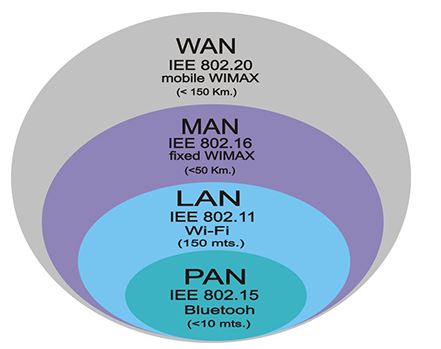
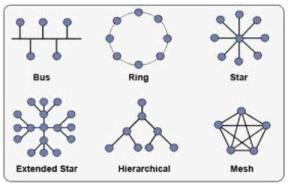
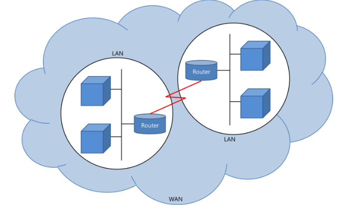

# ✅네트워크 분류

> 네트워크는 규모를 기반으로 분류할 수 있다.
>
1. 사무실과 개인적으로 소유 가능한 규모인 LAN
2. 서울시 등 시 정도의 규모인 MAN
3. 세계규모의 WAN

## ✔LAN

- LAN은 근거리 통신망을 의미하며 같은 건물이나 캠퍼스 같은 좁은 공간에서 운영됨.
- 전송속도가 빠르고 혼잡하지 않음

### 🔹특징

- [Ethernet](https://gaesung.tist), [Token Ring](https://hihack.tistory.com/entry/%EC%9D%B4%EB%8D%94%EB%84%B7Ethernet%EA%B3%BC-%ED%86%A0%ED%81%B0%EB%A7%81Token-ring), [FDDI](https://cainstorm.com/147) 형태로 구축 가능
- 다른 기종 간의 통신에서 사무 처리의 능률화가 극대화
- 기기 자원의 공유에 따른 이용 효율의 향상과 경비 절감효과를 누릴 수 있음

### 🔹****LAN의 구축형태****

- `**Bus Topology (버스형)**` : 신뢰성과 확장성이 좋으며 모든 노드 들이 버스에 T 자형으로 연결 되어 상호 Point - to - Poing 형태를 가진다.
- `**Ring Topology (링형)**` : 통신제어가 간단하고 신뢰성이 높으며 장거리 네트워크에서 사용 가능, 버스 형태와 달리 거리 제약이 적으며 잡음에도 강합니다
- `**Star Topology (스타형/성형)**` : 중앙 제어 방식으로 모든 기기가 Point - to - Point 방식으로 연결 되어 있으며 문제 해결이 쉽고 하나의 기기의 고장은 전체에 영향을 미치지 않지만 중앙 제어 장비가 고장이 나면 모든 시스템에 영향을 미치게 됨
- `**Mash Topology (메쉬형)**` : 모든 컴퓨터들이 연결되어진 형태, 연결 된 기기나 노드가 고장나더라도 다른 경로를 통해 통신이 가능하며 어떠한 경우에도 네트워크가 동작한다는 장점을 가짐.

## ✔MAN

- MAN은 대도시 지역 네트워크를 나타내며 도시 같은 넓은 지역에서 운영됨.
- 전송 속도는 평균이며 LAN보다는 더 혼잡

## ✔WAN

- WAN은 광역 네트워크를 의미하며 국가 또는 대륙 같은 더 넓은 지역에서 운영됨.
- 전송 속도는 낮으며 MAN보다 더 혼잡

### 🔹특징

- 인터넷의 형태
- ISP 인터넷 제공업체에서 관리하며 허가 없이 네트워크를 구축 할수는 없음.

### 🔹종류

- 전용선 : 연결되는 상태를 미리 결정해서 신뢰성이 높고, 향상된 품질로 데이터를 전송할 수 있으며 고속 전송이 가능
- 교환회선 : 전화망이나 ISDN이 있으며 상대와의 사이에 회선은 연결, 대역폭을 통해 어떤 정보라도 전달 가능.