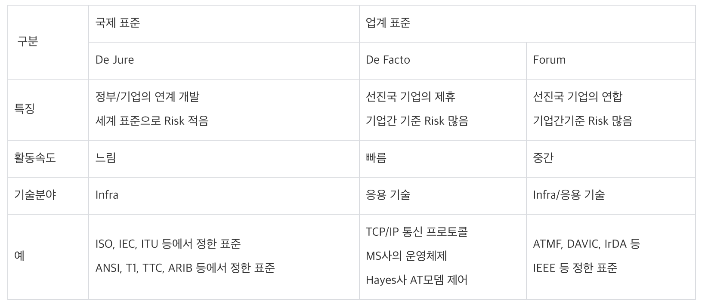

# 네트워크 프로토콜의 표준화

## 프로토콜 표준화

**프로토콜을 표준화하여 다른 기종간의 통신을 가능하게 하는 것**

예시: HTTP를 사용하면 HTTP라는 프로토콜을 통해 노드들은 웹 서비스를 기반으로 데이터를 주고받을 수 있다.

- 프로토콜: 다른 장치들 끼리 데이터를 주고받기 위해 설정된 공통 인터페이스를 말한다.

## **프로토콜 표준화의 목적**

- 안정성과 호환성 유지
- 생산 능률 향상과 생산비용 감소
- 경제의 효율성과 품질의 신뢰성
- 거래의 단순화와 소비의 합리화

## **프로토콜 표준화의 3S 원칙**

- **S**tandardization(표준화) : 합리적인 통신 표준을 설정하여 활용
- **S**implification(단순화) : 통신과 관련된 부분 중에 불필요한 부분은 줄이기
- **S**pecialization(전문화) : 통신수단에 최적화된 방법 개발, 경제 · 능률적으로 정보를 전달할 수 있는 체제 구축

## 프로토콜 표준화 방법의 유형

De jure Standard(표준) : 국제 기관 및 국가들이 공동으로 정한 표준.

De Facto Standard(사실상 표준): 국제 기관에서 인정받지는 못하지만 현재 가장 널리 쓰이고 있는 표준 방법.

## 국제 표준화 기구

- ITU(international Telecommunications Union) - 국제전기통신연합
    - 무선 통신과 전기 통신을 표준화.
- EIA(Electronic Industries Association) - 미국 전자 공업 협회
    - EIARS : 정보 통신 전기 특성, 데이터 통신에 관한 표준 제정
- ISO(International Standards Organization) - 국제 표준화 기구
    - 네트워크 통신 구조를 정의하는 OSI계층 모델을 개발하여 네트워크의 표준화를 이루었음.
- IEEE(Institute of Electrical and Electronics Engineers) - 미국 전기전자기술협회
    - LAN(Local Area Network)의 표준을 규정
- 등등

### 한국의 표준화 기구

- ETRI(Electronics and Telecommunication Research Institute) : 한국전자통신연구원
