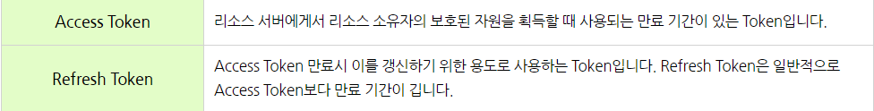

## OAuth 2.0이란?

- OAuth 2.0(Open Authorization 2.0, OAuth2)는 타 사이트에 대한 접근 권한을 얻고 그 권한을 이용하여 개발할 수 있도록 도와주는 개방형 프로토콜이다.
- 구글, 페이스북, 카카오, 네이버와 같은 플랫폼에 사용자 인증 과정을 위임하고 인증이 되면 해당 플랫폼에 저장되어 있는 데이터(이름, 이메일 등의 개인정보)를 가져와 제공해주는 것이다.

## OAuth 2.0의 장점

1. 이용하려는 서비스마다 회원가입을 일일이 다 할 필요 없이 기존의 사용하던 타 플랫폼의 정보를 이용하여 로그인을 진행할 수 있다.
2. 회원 정보 뿐만이 아니라 타 플랫폼이 제공하는 API에 대해서도 접근이 가능하다.

## OAuth 1.0과 2.0의 차이

- 기존 서비스 제공자(Service Provider)를 자원 및 권한 서버로 분리하여 다수의 서비스 제공자(서버)로 구성 웹 서비스에서 발생 가능한 권한 동기화 문제 개선
- 오픈 API 요청 시 클라이언트 인증 방법으로 서명 대신, HTTPS를 의무화하여 서버 및 클라이언트 개발 편의성 개선
- 다양한 유형의 클라이언트와 이를 고려한 권한 승인 방법을 정의하여 유형별 클라이언트들에 대한 일관된 구현 가능
- 접근 토큰 재발급을 위한 재발급 토큰(Refresh Token)을 도입함으로써 접근 토큰의 유효 기간 단축 및 보안성 개선
    - 접근 토큰의 유효 기간이 과도하게 긴 경우, 접근 토큰이 유출된 경우 공격자에 의해 장시간 악용 가능
- 기타 다양한 확장성 지원

## 기본적인 OAuth 2.0 동작 방식

Authorization Code Grant - 권한 부여 승인 코드 방식

A/S : Authorization, Server R/S : Resource Server

1. 소셜 로그인을 제공하는 API 서버에 redirect_url을 등록하고 client_id 발급(기초 설정)
2. User가 “소셜 로그인 하기” 버튼을 누르면 Client가 A/S에게 client_id, redirect_url, scope를 포함하여 승인 요청
3. 로그인 창 제공
4. 로그인을 하면 A/S는 인증된 코드를 클라이언트에게 제공
5. 클라이언트는 인증코드를 넘겨주며 A/S에 Access Token 요청
6. A/S는 클라이언트에게 Access Token 발급
7. Access Token을 이용하여 R/S에서 데이터를 요청
8. Access Token이 만료되면 refresh token을 이용해 재발급

## OAuth 2.0프로토콜을 구성하는 4가지 역할

## OAuth 2.0 Token

- Access Token은 리소스 (사용자 정보) 에 직접 접근할 수 있도록 해주는 정보만을 가지고 있다. Refresh Token에 비해 짧은 만료 기간을 가지며, 주로 세션에 담아 관리한다.
- Refresh Token은 새로운 Access Token을 발급받기 위한 정보를 담고 있다. 클라이언트가 Access Token이 없거나 만료된 상태라면, Refresh Token을 통해 Auth Server에 요청하여 새로운 Access Token을 발급 받을 수 있다. Refresh Token은 외부에 노출되지 않도록 하기 위해 보통은 DB에 저장하곤 한다.

## OAuth 2.0 사용 방식

- 회원 가입을 구현할 때
    - Access token을 사용해 Resource Server에서 가져온 데이터만 사용하여 인증할 수 있다. 이 경우 DB를 따로 사용하지 않고 클라이언트의 쿠키를 사용해 인증이 가능하다.
    - 만약 추가적인 데이터를 가져오고 싶다면 Resource Server에서 가져온 데이터와 추가로 받은 데이터를 같이 DB에 저장하여 사용하면 된다.

  

### 출처

---

- [https://blog.naver.com/mds_datasecurity/222182943542](https://blog.naver.com/mds_datasecurity/222182943542)
- [https://velog.io/@tmdgh0221/Spring-Security-와-OAuth-2.0-와-JWT-의-콜라보](https://velog.io/@tmdgh0221/Spring-Security-%EC%99%80-OAuth-2.0-%EC%99%80-JWT-%EC%9D%98-%EC%BD%9C%EB%9D%BC%EB%B3%B4)
- [https://velog.io/@silverj-kim/Front-end-로그인-구현-1-OAuthJWTSession](https://velog.io/@silverj-kim/Front-end-%EB%A1%9C%EA%B7%B8%EC%9D%B8-%EA%B5%AC%ED%98%84-1-OAuthJWTSession)
- [https://developers.google.com/identity/protocols/oauth2/web-server](https://developers.google.com/identity/protocols/oauth2/web-server)