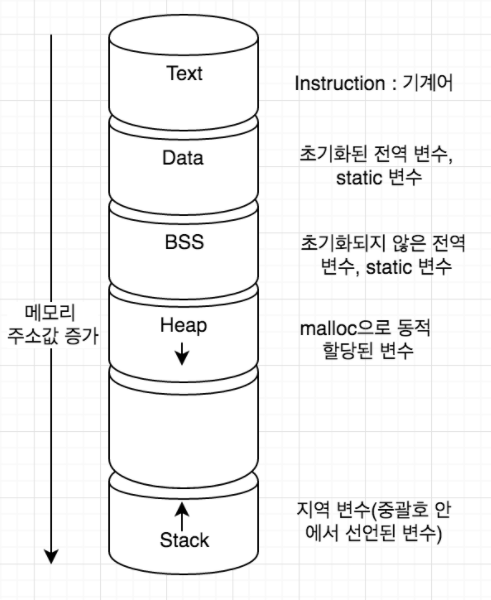

# 프로세스 (Process)

# 1. 프로세스(Process)란?

- 메인 메모리에 할당되어 실행중인 상태의 프로그램
- `프로세스`와 `프로그램`의 차이

  프로그램(하드디스크에서 실행을 기다리는 코드와 데이터의 묶음) 자체는 생명이 없음

  프로그램의 명령어와 데이터가 메모리에 적재되면 생명이 있는 프로세스가 됨

- 스케줄링의 대상이 되는 작업과 같은 의미
- 프로세스 내부에는 하나 이상의 스레드(Thread)가 있음 → **스레드 단위로 스케줄링**
- 하드디스크에 있는 프로그램 실행 → 실행을 위해 메모리 할당 → 할당된 메모리 공간으로 바이너리 코드가 올라감 → 이때부터 프로세스

# 2. 프로세스의 구조

- 프로세스 하나당 구조가 하나씩 있음
1. `Code 영역`
   - 프로그램을 실행시키는 실행 파일 내의 명령어들이 올라감
   - 쉽게 말해서 소스코드가 올라간다
2. `Data 영역`
   - 전역변수, static 변수가 할당됨
3. `Heap 영역`
   - 동적 할당을 위한 메모리 영역
4. `Stack 영역`
   - 지역변수, 함수 호출 시 전달되는 인자를 위한 메모리 영역

# 3. 프로세스 스케줄링

- CPU가 하나인데 동시에 실행되어야 할 프로세스가 여러개인 경우

  → CPU가 고속으로 여러 프로세스를 일정한 기준으로 순서를 정해서 실행

- `스케줄링(Scheduling)`
   - CPU 할당 순서 및 방법을 결정하는 일
   - 어떤 프로세스를 running 상태로 보낼지 결정
   - 일정한 기준인 스케줄링 알고리즘을 통해서 결정한다 (예: 라운드로빈)

# 4. 프로세스 상태 변화

- `new` : 프로그램이 메인 메모리에 할당됨
- `ready` : 할당된 프로그램이 초기화와 같은 작업을 통해서 실행되기 위한 모든 준비를 마침
- `running` : CPU가 해당 프로세스를 실행
- `waiting` : 프로세스가 끝나지 않은 시점에서 I/O로 인해서 CPU를 사용하지 않고 다른 작업을 수행 (해당 작업이 끝나면 다시 CPU에 의해서 실행되기 위해 ready 상태로 돌아가야함)
- `terminate` : 프로세스가 완전히 종료됨

[프로세스 상태 전이도]

# 5. 프로세스 제어 블록 (Process Control Block, PCB)

- 프로세스에 대한 모든 정보가 모여있는 곳
- 특정 프로세스에 대한 중요한 정보를 저장하고 있는 운영체제의 자료구조
- 운영체제는 프로세스를 관리하기 위해 프로세스의 생성과 동시에 고유한 PCB 생성
- 운영체제 내부에 프로세스를 관리하는 코드 부분에 저장되어 있음
- CPU가 한 프로세스가 종료될 때까지 수행하는게 아니라 여러 프로세스를 중간 중간 바꿔가면서 수행한다

  → CPU가 수행중인 프로세스를 나갈 때 프로세스의 정보를 어딘가에 저장하고 있어야 다음에 이 프로세스를 수행할 때 이전에 수행한 작업에 이어서 수행할 수 있음

- PCB에 저장되는 정보
   - `프로세스 식별자 (Process ID, PID)` : 프로세스를 식별하기 위해 부여된 프로세스 식별 번호
   - `프로세스 상태` : new, ready, running, waiting, terminated 등
   - `프로그램 카운터` : CPU가 다음에 실행할 명령어의 주소
   - `CPU 레지스터`
   - `CPU 스케쥴링 정보` : 프로세스의 우선순위, 스케줄 큐에 대한 포인터 등
   - `메모리 관리 정보` : 페이지 테이블 또는 세그먼트 테이블과 같은 정보
   - `입출력 상태 정보` : 프로세스에 할당된 입출력 장치들과 열린 파일 목록
   - `어카운팅 정보` : 사용된 CPU 시간, 시간제한, 계정 정보 등

# 6. 프로세스 큐 (Process Queue)

- 프로세스는 수행하면서 상태가 여러번 변함

  → 상태가 변할 때 마다 서비스를 받아야 하는 곳이 달라짐

  프로세스는 일반적으로 여러개가 한번에 수행됨 → 순서가 필요하다

  ⇒ **순서를 대기하는 곳이 큐**

- 큐 종류
   - `Job Queue` : 하드디스크에 있는 프로그램이 실행되기 위해 메인메모리의 할당 순서를 기다리는 큐
   - `Ready Queue` : CPU 점유 순서를 기다리는 큐
   - `Device Queue` : 입출력을 하기 위한 각 장치를 기다리기 위한 큐
- 각 큐 내부에 저장된 실제 데이터는 각 프로세스의 PCB가 저장되어 있음
- 스케줄링 : 순서를 기다리는 공간에서 순서를 정해주는 알고리즘

  **Job Queue** - Job Scheduler (Long-term scheduler 스케줄링이 발생하는 시간이 오래 걸림)

  **Ready Queue** - CPU Scheduler (Short-term scheduler 스케줄링이 발생하는 시간이 짧음)

  **Device Queue** - Device Scheduler

# 7. 프로세스가 접근할 수 있는 메모리 공간

- PCB에 프로세스의 **데이터와 명령어가 있는 메모리** 위치를 가리키는 포인터 정보가 들어 있음
1. `Text` : 기계어
2. `Data` : 초기화된 전역 변수, static 변수
3. `BSS` : 초기화되지 않은 전역 변수, static 변수
4. `Heap` : malloc으로 동적 할당된 변수
5. `Stack` : 지역 변수
- 스택과 힙 사이의 빈 공간 : 컴파일 타임에 지역 변수를 얼마나 사용할지 미리 계산할 수 없어서 런타임에 지역변수 선언 순서에 따라서 스택 영역은 위쪽으로 주소값을 매기고 힙 영역은 동적 할당될 때 아래쪽으로 주소값을 매긴다
